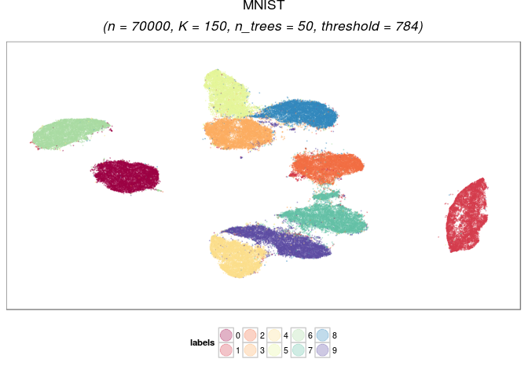
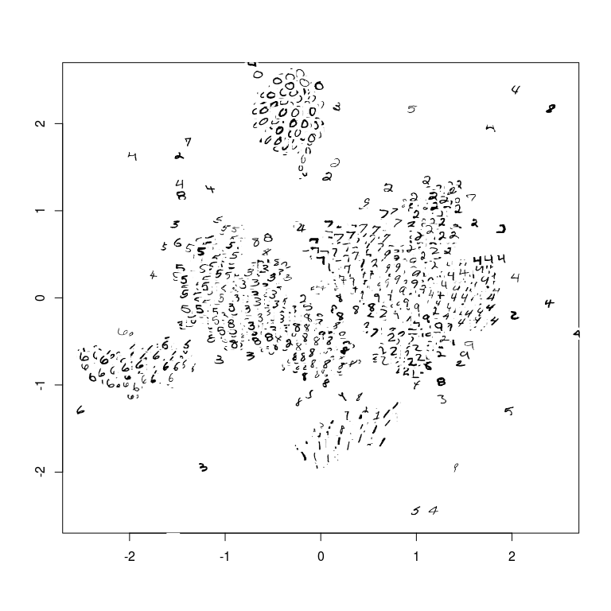

largeVis
================

[](https://travis-ci.org/elbamos/largeVis) [](https://codecov.io/github/elbamos/largeVis?branch=0.1.5)[](https://gitter.im/elbamos/largeVis?utm_source=badge&utm_medium=badge&utm_campaign=pr-badge&utm_content=badge)[](https://ci.appveyor.com/project/elbamos/largeVis)

This is an implementation of the `largeVis` algorithm described in (<https://arxiv.org/abs/1602.00370>). It also incorporates code for a very fast algorithm for estimating k-nearest neighbors, and for visualizing a map of the manifold.

The inner loops for nearest-neighbor search and gradient descent are implemented in C++ using `Rcpp` and `RcppArmadillo`.

For details of usage and examples, see the vignette [here](vignettes/largeVis.md).

#### Project Status & Caveats

-   Support for sparse matrices!
-   Now tested with (dense) matrices &gt; 1 Million rows, and sparse matrices with &gt; 10,000 features.
-   Memory efficiency and performance are excellent. Memory efficiency can be improved further by using utility functions to perform the algorithm in stages. (Explained in the vignette.)
-   Not yet working:
    -   The alternative distance function (*α* = 0) is not fully implemented.
    -   The visualization map function has had minimal testing, and the transparency feature does not yet work as intended.
-   I am attempting to replicate the paper's results with larger and larger datasets. This takes time because my hardware is not as powerful as the authors'. If you have any to volunteer, please contact me!

#### Examples:

##### MNIST

``` r
load("./mnist.Rda")
dat <- mnist$images
dim(dat) <- c(42000, 28 * 28)
dat <- (dat / 255) - 0.5
dat <- t(dat)
coords <- vis(dat, check=FALSE,
                   n_tree = 50, tree_th = 700,
                   K = 100,  max.iter = 1)
```



``` r
flip <- function(x) apply(x,2,rev)
rotate <- function(x) t(flip(x))

mnistimages <- apply(mnist$images,
    MARGIN=1,
    FUN = function(x) as.array(rotate(flip(x))))
mnistimages <- t(mnistimages)
dim(mnistimages) <- c(42000, 28, 28)
coords <- as.matrix(coords[,1:2])
coords <- scale(coords)
manifoldMap(coords,
    n = 5000,
    scale = 0.005,
    transparency = FALSE,
    images = mnistimages,
    xlab="", ylab="",
    xlim = c(-2.5, 2.5), 
    ylim = c(-2.5, 2.5))
```


